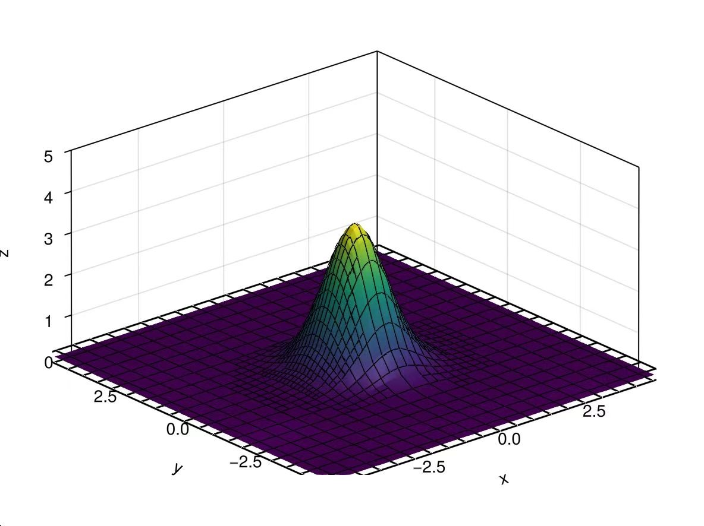

# KitAMR.jl


[](https://codecov.io/gh/CFDML/KitAMR.jl)

## Motivation
**KitAMR.jl** is a distributed adaptive Cartesian grid solver for kinetic equations, developed based on [P4est.jl](https://github.com/trixi-framework/P4est.jl). Its goal is to achieve large-scale parallel solving of 2D and 3D flows across all regimes, leveraging GPUs, differentiable programming, and machine learning to enhance solving efficiency.

For 1.0 version, we enable the solver to determinately simulate rarefied flows with high efficiency. The following functionalities have been implemented:
- Physical mesh generation for arbitrary boundary geometry;
- Immersed boundary method for Maxwellian gas-surface interaction model;
- Geometric adaptation of physical space grids;
- Dynamic adaptation of physical space grids;
- Dynamic adaptation of velocity space grids;
- Distributed parallelism on CPUs;
- Load balancing based on phase space grid density;
- Linear reconstruction with second-order spatial accuracy;
- Composite Newton-Cotes rule with second-order quadrature accuracy;
- VTK&JLD output for post-processing.

All of the funcationalities are applicable to both 2D and 3D cases.

## Theory
### Kinetic Methods
In kinetic theory, methods simulate the macroscopic motion of fluids by describing the evolution of distribution functions of fluid particles in velocity space over time. Such methods include direct simulation Monte Carlo (DSMC), discrete velocity method (DVM), lattice Boltzmann equation (LBE), gas-kinetic scheme, semi-Lagrangian method, implicit-explicit (IMEX) method, and others.
### Distribution Function
In kinetic methods, the state of the fluid is described by a distribution function ``f(\mathbf{x},\mathbf{u},t)``. The distribution function represents the number of particles at a given moment in time at a specific physical space point in a particular velocity space element. Its normalization property is

```math
\rho(\mathbf{x},t)=\iiint_{-\infty}^{\infty}f(\mathbf{x},\mathbf{u},t)d\mathbf{u}
```

, where ``\rho(\mathbf{x},t)`` is the density of flows at ``\mathbf{x}`` in time ``t``. At higher temperatures, molecular internal degrees of freedom are excited, and the distribution function will depend on these degrees of freedom as well. For simplicity, we do not currently consider this situation.


```@raw html
<div align="center">
    
    <figcaption><i>The distribution function in 2D velocity space.</i></figcaption>
</div>
```

With the distribution function, macroscopic conservative variables can be caculated as follows:

```math
\begin{split}
&\rho = \iiint_{-\infty}^{\infty}f(\mathbf{x},\mathbf{u},t)d\mathbf{u}\\
&\rho\mathbf U = \iiint_{-\infty}^{\infty}\mathbf uf(\mathbf{x},\mathbf{u},t)d\mathbf{u}\\
&\rho E = \iiint_{-\infty}^{\infty} \frac 12 \mathbf u^2f(\mathbf{x},\mathbf{u},t)d\mathbf{u}\\
&\mathbf q=\iiint_{-\infty}^{\infty} \mathbf u\frac 12 \mathbf u^2f(\mathbf{x},\mathbf{u},t)d\mathbf{u}
\end{split}
```

### Boltzmann Equation
The evolution of the distribution function follows the Boltzmann equation.

```math
\frac{\partial f}{\partial t}+\mathbf{u}\cdot\frac{\partial f}{\partial \mathbf{x}}+\mathbf{F}\cdot\frac{\partial f}{\partial \mathbf{u}}=\iiint_{-\infty}^{\infty}\int_0^{4\pi}(f^{*}f_1^{*}-ff_1)c_r\sigma d\Omega dc_1
```

The Boltzmann equation holds a central position in kinetic theory, which is an integro-differential equation, with a four-fold integral term on the right-hand side. The complexity introduced by this term makes solving the Boltzmann equation challenging. Therefore, as a simplification, kinetic methods often solve its model equations instead.
### Shakhov Model Equation
The simplified equation obtained after simplifying the collision term is known as the Shakhov model equation:

```math
\begin{cases}
\frac{\partial f}{\partial t}+\mathbf{u}\cdot\frac{\partial f}{\partial \mathbf{x}}+\mathbf{F}\cdot\frac{\partial f}{\partial \mathbf{u}}=\frac{g^+-f}{\tau}\\
g^+=g[1+\frac45(1-\mathrm{Pr})\lambda^2\frac{\mathbf{u}\cdot\mathbf{q}}{\rho}(2\lambda \mathbf{u}^2-5)]
\end{cases}
```

, Where ``\mathrm {Pr}`` is the Prandtl number, ``\mathbf{q}`` is the heat flux, and ``\tau`` is the relaxation time typically given through phenomenological models to match experimental data. The Shakhov model can provide results close to the Boltzmann equation for mass, momentum, energy, and heat fluxes in situations where flow velocities are not very high and deviations from equilibrium are not very large. And the current solver is based on Shakhov model.

## Computing Methods
### Finite Volume Method (FVM)
The underlying discretization of the Boltzmann equation is based on finite volume method, with its discrete form as follows:

```math
\{\overline U_j\Omega_j\}^{n+1} = 
\{\overline U_j \Omega_j\}^n-\Delta t\sum_{\partial\Omega}\mathbf{F}^{*}\cdot\Delta\mathbf{S}+\Delta t \overline{Q}_j\Omega_j
```

, where ``\overline U_j^n\coloneqq\frac{1}{\Omega_j}\int_{\Omega_j}Ud\Omega_j|^n``, ``\overline Q_j^n\coloneqq\frac{1}{\Omega_j}\int_{\Omega_j}Qd\Omega_j`` are the cell-averaged conservative variable and source. And ``\overline Q_j^{*}`` and ``\mathbf{F}^{*}`` are respectively cell- and time-averaged sources and numerical flux, which are defined as ``\overline Q_j^{*}\coloneqq\frac{1}{\Delta t}\int_n^{n+1}\overline Q_jdt`` and ``\mathbf F^{*}\cdot \Delta \mathbf{S}\coloneqq \frac{1}{\Delta t}\int_n^{n+1}\mathbf F\cdot\Delta \mathbf{S}dt``.
It is an exact relation for the time evolution of the space averaged conservative avriables over cell ``j`` from time step ``n`` to ``n+1``. And the numerical flux ``\mathbf F^{*}`` identifies completely a scheme by the way it approximates the time-averaged physical flux along each cell face.
### Numerical Flux
The numerical scheme that the solver currently supports is UGKS, with interface variables obtained from VanLeer reconstruction. For specific implementation details, please refer to the relevant literature.

### Discrete Velocity Method
DVM is one of the popular approaches for solving rarefied flow problems. In this method, the particle velocity space is discretized into a finite set of points and the numerical quadrature rule is utilized to approximate the integration of moments. Since the particle velocity space is discretized into a finite set of points, the continuum Boltzmann equation is reduced to the corresponding discrete velocity Boltzmann equation (DVBE). Based on the original DVM, great variety of algorithms have been developed, including unified gas-kinetic scheme (UGKS), discrete unified gas-kinetic scheme (DUGKS), semi-Lagrangian method, etc. Most of the above methods can be applied from free molecular regime to continuum regime. But in order to make the quadrature error to be small enough, a large number of discrete velocity points are usually required. In particular, for fluid flows near continuum regime, the computational cost of DVM is much larger than those traditional CFD methods based on the Navier-Stokes equation.

### Adaptive Mesh Refinement (AMR)
Considering the above limitation of DVM, we adopt Adaptive Mesh Refinement (AMR) to improve solving efficiency. AMR reallocates computational resources based on flow features, balancing efficiency and accuracy. 

```@raw html
<div align="center">
    
    <figcaption><i>Hypersonic rarefied flow over a cylinder. The simultaneous AMR in physical space (left) and velocity space (right) are performed.</i></figcaption>
</div>
```


The current solver discretizes with tree-based Cartesian grids, adapting the mesh in both physical and velocity space simultaneously, according to characteristics like conserved variables' gradients and the mass and energy proportion at the velocity collocations. Users can also customize the criteria for grid refinement or coarsening according to their own needs.

For an AMR solver, the load-balance ability is crucial for high efficiency. KitAMR.jl inherits the load-balance functionality in p4est. The domain decomposition is performed in physical space. The physical grids are encoded into a 1-dimensional sequence by Morton code, and are partitioned to maintain the phase grids number on each processor approximately equal.

```@raw html
<div align="center">
    
    <figcaption><i>The variation of the processor rank in physical domain during a simulation.</i></figcaption>
</div>
```


### Cartesian Grids
Cartesian grids offer advantages such as high grid quality, automated mesh generation, nature of the parallelism and capability for dynamic adaptation, but struggle with complex boundary geometries. To address this challenge, we developed an Immersed Boundary Method (IBM) for the discrete velocity model of the Boltzmann equation, which has been planted in KitAMR.jl. For more details, you may refer to our paper: https://doi.org/10.48550/arXiv.2512.20252.
